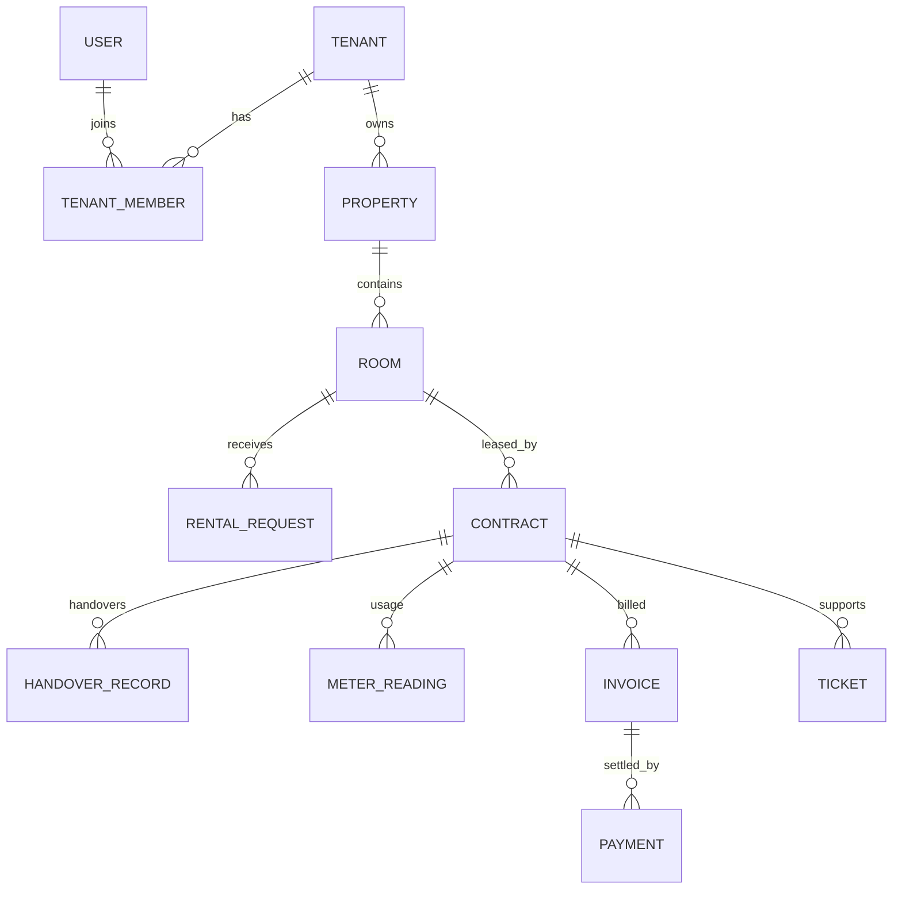

# Tài liệu cơ sở dữ liệu PostgreSQL/Prisma

> Canonical schema: `prisma/schema.prisma`, hợp lệ theo Prisma 7 ngày 31/07/2026. Schema hiện có **61 model** và **49 enum**.

## 1. Nguyên tắc thiết kế

- Khóa chính hiện chủ yếu là integer tự tăng; tài liệu không giả định UUID.
- Dữ liệu tenant gắn `tenant_id` trực tiếp hoặc đi qua quan hệ bắt buộc.
- Dữ liệu vận hành dùng audit field/soft delete theo miền.
- Luồng tiền/token/webhook/contract dùng transaction, conditional update hoặc unique constraint.
- Prisma model dùng `@@map`/`@map` để ánh xạ snake_case PostgreSQL.

## 2. Danh mục bảng

### 2.1. Identity, token và phân quyền

| Model | Table | Vai trò |
|---|---|---|
| `User` | `users` | Tài khoản, trạng thái, hồ sơ |
| `RefreshToken` | `refresh_tokens` | Rotation/revoke/replay |
| `Device` | `devices` | Device fingerprint/trust |
| `VerificationCode` | `verification_codes` | OTP expiry/attempt/atomic consume |
| `Role` | `roles` | Vai trò hệ thống |
| `Permission` | `permissions` | Permission catalog |
| `RolePermission` | `role_permissions` | Nối role–permission |

### 2.2. SaaS tenant và billing

| Model | Table | Vai trò |
|---|---|---|
| `Tenant` | `tenants` | Đơn vị chủ trọ |
| `TenantMember` | `tenant_members` | Membership/role theo tenant |
| `Plan` | `plans` | Gói SaaS |
| `Subscription` | `subscriptions` | Gói hiện hành |
| `SubscriptionPayment` | `subscription_payments` | PayOS checkout/lịch sử |

### 2.3. Nhà, phòng và marketplace

| Model | Table | Vai trò |
|---|---|---|
| `Property` | `properties` | Nhà trọ/chung cư mini |
| `Floor` | `floors` | Tầng |
| `Room` | `rooms` | Phòng và trạng thái marketplace |
| `MarketplaceModeration` | `marketplace_moderations` | Lịch sử moderation |
| `RoomImage` | `room_images` | Ảnh/thumbnail/public ID |
| `Amenity` | `amenities` | Danh mục tiện ích |
| `RoomAmenity` | `room_amenities` | Nối room–amenity |

### 2.4. Renter và hành trình tìm thuê

| Model | Table | Vai trò |
|---|---|---|
| `RenterInvitation` | `renter_invitations` | Lời mời one-time có expiry |
| `RenterProfile` | `renter_profiles` | Hồ sơ người thuê |
| `RentalHistory` | `rental_histories` | Lịch sử thuê |
| `RoomViewLog` | `room_view_logs` | Lượt xem |
| `FavoriteRoom` | `favorite_rooms` | Yêu thích; API còn backlog |
| `RoomViewingAppointment` | `room_viewing_appointments` | Lịch xem phòng |
| `RentalRequest` | `rental_requests` | Yêu cầu thuê |

### 2.5. Hợp đồng, tài sản và bàn giao

| Model | Table | Vai trò |
|---|---|---|
| `ContractTemplate` | `contract_templates` | Mẫu hợp đồng; API còn backlog |
| `Contract` | `contracts` | Hợp đồng |
| `ContractMember` | `contract_members` | Thành viên hợp đồng |
| `ContractFile` | `contract_files` | File/signature metadata; API còn backlog |
| `ContractTerminationRequest` | `contract_termination_requests` | Yêu cầu thanh lý |
| `AssetCategory` | `asset_categories` | Danh mục tài sản |
| `RoomAsset` | `room_assets` | Tài sản trong phòng |
| `HandoverRecord` | `handover_records` | Check-in/out/dispute |
| `HandoverAssetItem` | `handover_asset_items` | Snapshot tài sản |

### 2.6. Điện nước, OCR và dịch vụ

| Model | Table | Vai trò |
|---|---|---|
| `UtilityMeter` | `utility_meters` | Đồng hồ/đơn giá |
| `MeterReading` | `meter_readings` | Chỉ số theo kỳ |
| `OcrJob` | `ocr_jobs` | OCR/review/accept |
| `ServiceCatalogItem` | `service_catalog_items` | Danh mục phí dịch vụ |
| `ServiceAssignment` | `service_assignments` | Gán dịch vụ |

### 2.7. Hóa đơn, công nợ và thanh toán

| Model | Table | Vai trò |
|---|---|---|
| `InvoiceBatch` | `invoice_batches` | Batch; orchestration còn backlog |
| `Invoice` | `invoices` | Hóa đơn |
| `InvoiceItem` | `invoice_items` | Tiền phòng/utility/service |
| `Debt` | `debts` | Công nợ |
| `Payment` | `payments` | Manual/PayOS payment |
| `PaymentQrCode` | `payment_qr_codes` | QR active/expired |
| `PaymentWebhookLog` | `payment_webhook_logs` | Payload sanitize/digest/retention |

### 2.8. Ticket và conversation

| Model | Table | Vai trò |
|---|---|---|
| `Ticket` | `tickets` | Sự cố |
| `TicketAttachment` | `ticket_attachments` | File đính kèm |
| `TicketComment` | `ticket_comments` | Comment public/internal |
| `Conversation` | `conversations` | Nền tảng chat; API còn backlog |
| `ConversationMember` | `conversation_members` | Thành viên hội thoại |
| `Message` | `messages` | Message/chat |

### 2.9. Trust, notification và governance

| Model | Table | Vai trò |
|---|---|---|
| `Review` | `reviews` | Đánh giá/moderation |
| `ReputationScore` | `reputation_scores` | Điểm tổng hợp; workflow backlog |
| `Report` | `reports` | Báo cáo vi phạm |
| `Notification` | `notifications` | Inbox/dispatch state |
| `DeviceToken` | `device_tokens` | Firebase token |
| `BackgroundJob` | `background_jobs` | Metadata job |
| `AuditLog` | `audit_logs` | Audit; API query backlog |
| `SystemSetting` | `system_settings` | Cấu hình; API backlog |

Schema không còn bảng AI recommendation, AI pricing hoặc chatbot. Conversation/message là chat nghiệp vụ, không phải chatbot AI.

## 3. Quan hệ chính



## 4. Ràng buộc và transaction

- Unique provider/transaction cho `payments` và `subscription_payments` ngăn webhook trùng.
- Partial unique giới hạn subscription/payment pending theo tenant.
- OTP consume điều kiện chưa consumed/invalidated và chưa hết hạn.
- Payment approval/webhook cập nhật payment–invoice–debt atomically.
- Rental request/contract activation claim room bằng conditional update.
- Handover/termination/review/report dùng expected status và actor/timestamp.
- Dashboard/ticket/payment có composite index theo tenant/status/date.
- Query public/tenant phải áp dụng tenant scope và soft-delete filter phù hợp.

## 5. Migration chronology

| Migration | Nội dung chính |
|---|---|
| `20260702154100_init_db` | Baseline schema |
| `20260706091756_add_audit_fields` | Audit fields |
| `20260706100029_add_otp_secret` | OTP secret |
| `20260706182440_add_super_admin_and_change_id_role` | ADMIN/role IDs |
| `20260707020000_add_auth_tokens` | Refresh/device/verification |
| `20260707143329_refactor_field_id` | Refactor ID fields |
| `20260709120000_add_room_image_public_id` | Cloudinary public ID |
| `20260712183000_add_debts_table` | Debts |
| `20260716000000_add_payos_payment_fields` | PayOS invoice payment |
| `20260716183000_add_ticket_notification_fields` | Ticket/notification |
| `20260716203000_add_dashboard_indexes` | Dashboard indexes |
| `20260722090000_add_payment_provider_reference_unique` | Payment idempotency |
| `20260722130000_secure_payment_webhook_logs` | Sanitized log/digest rollout |
| `20260722133000_add_ticket_relation_indexes` | Ticket relation indexes |
| `20260724220000_add_marketplace_moderation` | Marketplace moderation |
| `20260726090000_add_subscription_payos_billing` | Subscription billing |
| `20260726150000_add_ocr_workflow` | OCR workflow |
| `20260729120000_complete_g05_handover_termination` | G05 state/constraints |
| `20260730120000_complete_g12_trust_moderation` | Review/report moderation |
| `20260731100000_add_renter_invitations` | Renter invitation |
| `20260731110000_add_service_catalog` | Service catalog/assignment |

## 6. Quy trình an toàn

```bash
npx prisma validate --schema prisma/schema.prisma
npx prisma migrate status --schema prisma/schema.prisma
npx prisma migrate deploy --schema prisma/schema.prisma
npx prisma generate
```

- Review SQL migration và backup theo mức rủi ro.
- Không dùng `migrate dev/reset` ở production.
- Webhook log dùng runbook sanitize riêng vì HMAC secret chỉ có runtime.
- Không sửa generated Prisma Client thủ công.

## 7. Giới hạn kiểm chứng

`prisma validate` đã đạt. Migration status trên database thật, drift, query plan, lock contention và rollback chưa được kiểm tra trong đợt tài liệu này.
