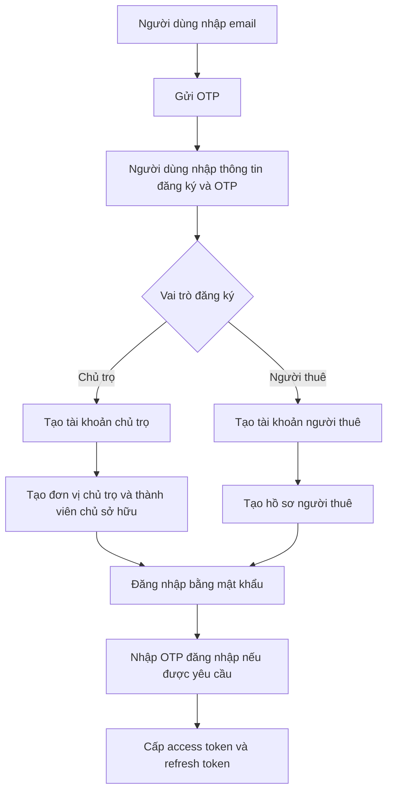
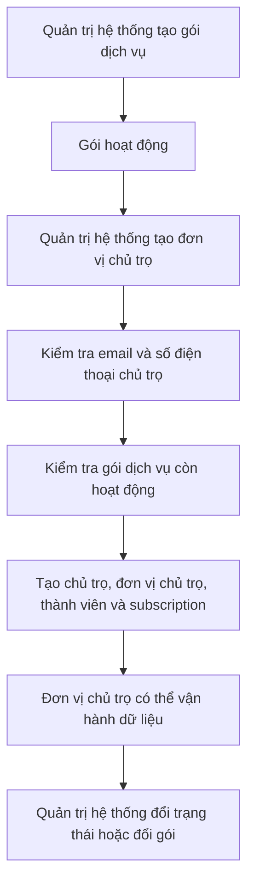
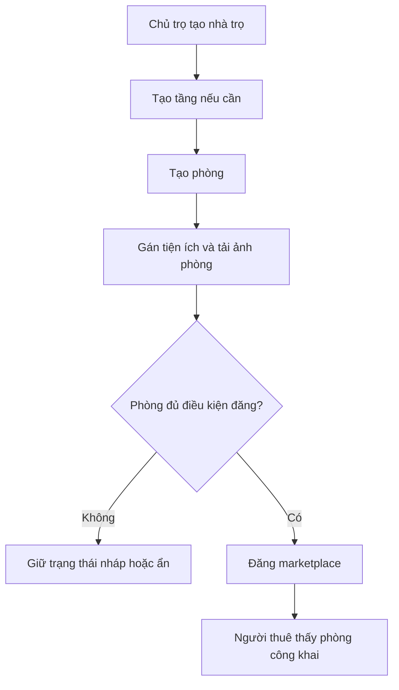
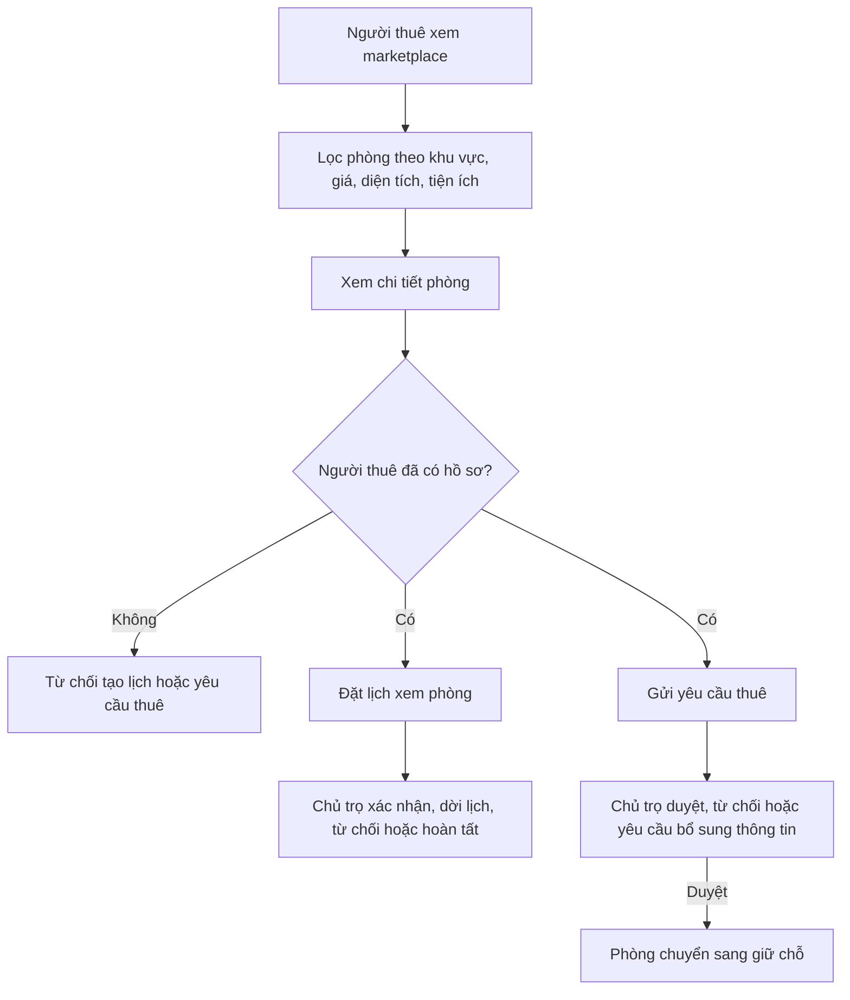
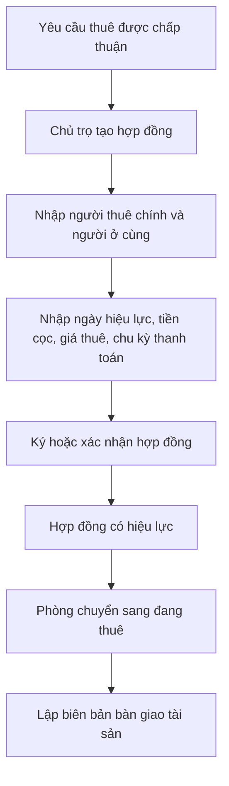
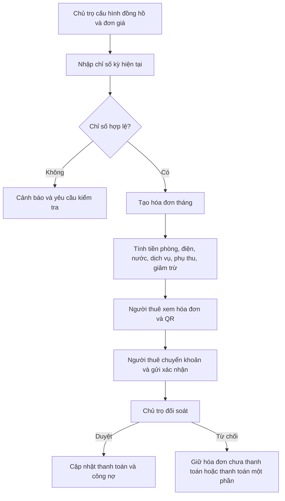
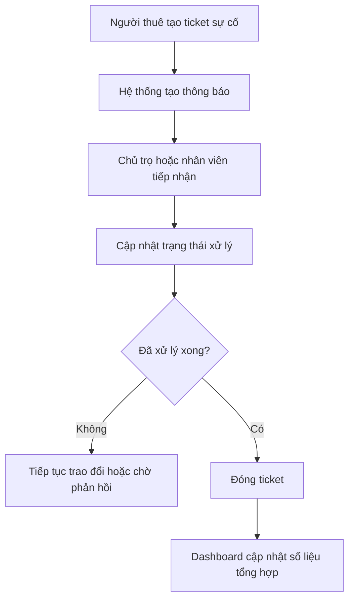

# Tài liệu phân tích nghiệp vụ hệ thống

**Hệ thống:** Nền tảng Web/App quản lý và cho thuê phòng trọ, chung cư mini theo mô hình SaaS & Marketplace  
**Phiên bản tài liệu:** 1.0  
**Ngày cập nhật:** 2026-07-10  
**Nguồn đối chiếu chính:** Prisma schema hiện tại, backend modules hiện có, tài liệu yêu cầu MVP, tài liệu kiến trúc MVP

## 1. Tổng quan và mục tiêu

### 1.1. Mục tiêu hệ thống

Hệ thống hỗ trợ chủ trọ và đơn vị vận hành phòng trọ quản lý toàn bộ vòng đời thuê phòng, từ đăng phòng, tiếp nhận người tìm phòng, tạo hợp đồng, quản lý điện nước, phát hành hóa đơn, ghi nhận thanh toán, xử lý sự cố đến theo dõi báo cáo vận hành.

Hệ thống cũng cung cấp marketplace để người tìm phòng xem phòng trống, lọc theo nhu cầu, đặt lịch xem phòng và gửi yêu cầu thuê.

### 1.2. Bài toán cần giải quyết

| Nhóm người dùng   | Bài toán hiện tại                                                                     | Kết quả hệ thống cần đạt                                                          |
| ----------------- | ------------------------------------------------------------------------------------- | --------------------------------------------------------------------------------- |
| Quản trị hệ thống | Cần quản lý nhiều chủ trọ, gói dịch vụ và dữ liệu toàn nền tảng.                      | Quản lý được tài khoản chủ trọ, đơn vị chủ trọ, gói dịch vụ và dữ liệu tổng quan. |
| Chủ trọ           | Dữ liệu phòng, người thuê, hợp đồng, điện nước, hóa đơn và thanh toán thường rời rạc. | Quản lý tập trung dữ liệu vận hành theo từng đơn vị chủ trọ.                      |
| Quản lý nhà trọ   | Cần xử lý lịch xem phòng, yêu cầu thuê, phòng trống và sự cố hằng ngày.               | Có luồng xử lý rõ ràng, có trạng thái và lịch sử thao tác.                        |
| Người thuê        | Cần tìm phòng, đặt lịch, gửi yêu cầu thuê, xem hóa đơn, thanh toán và báo sự cố.      | Có kênh tự phục vụ trên marketplace hoặc ứng dụng người thuê.                     |

### 1.3. Nguyên tắc tài liệu

- **Rõ ràng:** Mỗi nghiệp vụ dùng từ ngữ cụ thể, tránh mô tả mơ hồ.
- **Đầy đủ:** Có luồng thành công, điều kiện từ chối và ngoại lệ.
- **Nhất quán:** Dùng một bộ thuật ngữ thống nhất trong toàn tài liệu.
- **Có thể kiểm thử:** Quy tắc được viết thành điều kiện đo được để QA tạo test case.
- **Độc lập với giải pháp kỹ thuật:** Tập trung vào hệ thống cần làm gì; chỉ nhắc tên model/module để xác định trạng thái hiện tại.

## 2. Phạm vi sản phẩm và trạng thái triển khai

### 2.1. Nhãn trạng thái

| Nhãn           | Ý nghĩa                                                                                 |
| -------------- | --------------------------------------------------------------------------------------- |
| Đã triển khai  | Có controller/service/module backend đang được import trong ứng dụng.                   |
| Có schema/docs | Có model trong schema hoặc mô tả trong tài liệu, nhưng chưa có module xử lý hoàn chỉnh. |
| Mở rộng sau    | Có nền tảng dữ liệu hoặc định hướng tích hợp, chưa phải luồng chính hiện tại.           |

### 2.2. Phạm vi theo nhóm nghiệp vụ

| Nhóm nghiệp vụ                             | Trạng thái                               | Mục tiêu nghiệp vụ                                                                |
| ------------------------------------------ | ---------------------------------------- | --------------------------------------------------------------------------------- |
| Xác thực, tài khoản, OTP, OAuth            | Đã triển khai                            | Đăng ký, đăng nhập, OTP, refresh token, Google OAuth, hồ sơ cá nhân.              |
| Vai trò và phân quyền                      | Có schema/docs                           | Phân quyền theo vai trò và quyền, đang được dùng qua guard/decorator.             |
| Đơn vị chủ trọ và gói SaaS                 | Đã triển khai một phần                   | Quản lý đơn vị chủ trọ, chủ sở hữu, gói dịch vụ và subscription hiện hành.        |
| Nhà trọ, tầng, phòng, ảnh, tiện ích        | Đã triển khai                            | Quản lý tài sản cho thuê và điều kiện đăng marketplace.                           |
| Marketplace, lịch xem phòng, yêu cầu thuê  | Đã triển khai                            | Người thuê tìm phòng, đặt lịch, gửi yêu cầu thuê; chủ trọ xử lý.                  |
| Hồ sơ người thuê                           | Đã triển khai một phần                   | Người thuê cập nhật hồ sơ; chủ trọ xem người thuê liên quan đến đơn vị mình.      |
| Hợp đồng, thành viên hợp đồng, thanh lý    | Có schema/docs                           | Quản lý hợp đồng thuê và trạng thái pháp lý của phòng.                            |
| Tài sản phòng và bàn giao                  | Có schema/docs                           | Ghi nhận tài sản khi nhận/trả phòng.                                              |
| Đồng hồ, chỉ số điện nước, OCR             | Có schema/docs, OCR là mở rộng sau       | Nhập chỉ số điện nước, hỗ trợ OCR khi kích hoạt.                                  |
| Hóa đơn và công nợ                         | Có schema/docs                           | Tạo hóa đơn tháng, tính tiền phòng, điện, nước, dịch vụ và công nợ.               |
| Thanh toán QR, lịch sử thanh toán, webhook | Có schema/docs, webhook là mở rộng sau   | Người thuê thanh toán thủ công qua QR; chủ trọ xác nhận; webhook để tích hợp sau. |
| Ticket sự cố và trao đổi                   | Có schema/docs                           | Người thuê báo sự cố, chủ trọ xử lý và cập nhật trạng thái.                       |
| Thông báo và token thiết bị                | Có schema/docs, push thật là mở rộng sau | Thông báo nội bộ và nền tảng gửi push notification.                               |
| Dashboard, audit, cấu hình hệ thống        | Có schema/docs                           | Tổng hợp chỉ số vận hành, lưu vết thao tác và cấu hình.                           |
| Đánh giá, uy tín, báo cáo vi phạm          | Có schema/docs                           | Hỗ trợ marketplace minh bạch hơn sau khi có dữ liệu thực tế.                      |

### 2.3. Ngoài phạm vi hiện tại

Các nghiệp vụ sau không thuộc phạm vi hiện tại vì đã được loại khỏi schema/tài liệu MVP hiện hành:

- AI gợi ý phòng.
- AI gợi ý giá thuê.
- Chatbot hỗ trợ.

OCR chỉ được giữ như nghiệp vụ hỗ trợ nhập chỉ số điện/nước, không phải hệ thống AI gợi ý.

## 3. Thuật ngữ thống nhất

| Thuật ngữ         | Ý nghĩa                                                                                        |
| ----------------- | ---------------------------------------------------------------------------------------------- |
| Quản trị hệ thống | Người quản lý toàn bộ nền tảng SaaS. Tương ứng vai trò admin/super admin.                      |
| Đơn vị chủ trọ    | Một tổ chức/chủ trọ trong mô hình SaaS, có dữ liệu vận hành riêng.                             |
| Chủ trọ           | Tài khoản sở hữu hoặc vận hành một đơn vị chủ trọ.                                             |
| Quản lý nhà trọ   | Nhân sự được phân quyền vận hành nhà/phòng trong một đơn vị chủ trọ.                           |
| Người thuê        | Người tìm phòng hoặc đang thuê phòng. Trong code hiện tại role này là `TENANT`.                |
| Nhà trọ           | Tòa nhà, cụm phòng, căn hộ hoặc chung cư mini do đơn vị chủ trọ quản lý.                       |
| Phòng             | Đơn vị cho thuê cụ thể thuộc một nhà trọ.                                                      |
| Marketplace       | Khu vực công khai để người thuê tìm và gửi yêu cầu thuê/xem phòng.                             |
| Yêu cầu thuê      | Đề nghị thuê một phòng cụ thể từ người thuê.                                                   |
| Lịch xem phòng    | Lịch hẹn giữa người thuê và chủ trọ/quản lý để xem phòng.                                      |
| Hợp đồng          | Thỏa thuận thuê phòng giữa chủ trọ và người thuê.                                              |
| Công nợ           | Số tiền còn phải trả của hóa đơn, tính bằng tổng tiền trừ số tiền đã thanh toán được xác nhận. |

## 4. Vai trò và quyền nghiệp vụ

| Vai trò           | Phạm vi quyền chính                                                                                      | Điều kiện kiểm soát                                                                                        |
| ----------------- | -------------------------------------------------------------------------------------------------------- | ---------------------------------------------------------------------------------------------------------- |
| Quản trị hệ thống | Quản lý gói dịch vụ, đơn vị chủ trọ, tài khoản chủ trọ, tiện ích hệ thống và dữ liệu tổng quan.          | Có quyền truy cập cấp hệ thống; không bị giới hạn bởi một đơn vị chủ trọ cụ thể khi xem dữ liệu tổng quan. |
| Chủ trọ           | Quản lý nhà, tầng, phòng, ảnh, tiện ích của phòng, người thuê liên quan, yêu cầu thuê và lịch xem phòng. | Chỉ thao tác dữ liệu thuộc đơn vị chủ trọ đang hoạt động của mình.                                         |
| Quản lý nhà trọ   | Hỗ trợ chủ trọ trong vận hành phòng, yêu cầu thuê, lịch xem phòng và người thuê.                         | Chỉ thao tác trong đơn vị chủ trọ được phân quyền.                                                         |
| Người thuê        | Xem marketplace, tạo hồ sơ, đặt lịch, gửi yêu cầu thuê, theo dõi yêu cầu và cập nhật hồ sơ cá nhân.      | Chỉ xem/sửa dữ liệu của chính mình; chỉ gửi yêu cầu khi có hồ sơ người thuê.                               |
| Nhân viên kế toán | Theo phạm vi sản phẩm đầy đủ, xử lý hóa đơn, thanh toán, công nợ.                                        | Chỉ thao tác dữ liệu tài chính trong đơn vị chủ trọ được phân quyền.                                       |
| Nhân viên bảo trì | Theo phạm vi sản phẩm đầy đủ, tiếp nhận và xử lý ticket sự cố.                                           | Chỉ thấy ticket được giao hoặc thuộc đơn vị chủ trọ được phân quyền.                                       |

## 5. Sơ đồ luồng nghiệp vụ

### 5.1. Đăng ký, đăng nhập và tạo hồ sơ

### 5.2. Quản lý đơn vị chủ trọ và gói dịch vụ

### 5.3. Tạo phòng và đăng marketplace

### 5.4. Tìm phòng, đặt lịch và gửi yêu cầu thuê

### 5.5. Hợp đồng, bàn giao và thuê phòng

### 5.6. Điện nước, hóa đơn, thanh toán và công nợ

### 5.7. Ticket, thông báo và dashboard

## 6. Quy tắc nghiệp vụ

### 6.1. Xác thực, tài khoản và phiên đăng nhập

**Trạng thái:** Đã triển khai.

| Mã         | Quy tắc                                                                                           |
| ---------- | ------------------------------------------------------------------------------------------------- |
| BR-AUTH-01 | Người dùng chỉ được đăng ký với vai trò Chủ trọ hoặc Người thuê.                                  |
| BR-AUTH-02 | Email đăng ký phải chưa tồn tại trong hệ thống.                                                   |
| BR-AUTH-03 | Mật khẩu phải có ít nhất 8 ký tự, tối đa 100 ký tự, có chữ hoa, chữ thường, số và ký tự đặc biệt. |
| BR-AUTH-04 | OTP có đúng 6 ký tự; OTP sai, hết hạn hoặc vượt quá số lần thử phải bị từ chối.                   |
| BR-AUTH-05 | Tài khoản bị vô hiệu hóa không được đăng nhập.                                                    |
| BR-AUTH-06 | Refresh token không hợp lệ, hết hạn hoặc đã bị thu hồi không được cấp phiên mới.                  |
| BR-AUTH-07 | Khi đăng xuất, refresh token của phiên hiện tại phải bị thu hồi.                                  |
| BR-AUTH-08 | Người dùng chỉ được cập nhật hồ sơ cá nhân khi đã đăng nhập.                                      |

**Tiêu chí kiểm thử chính:**

- Đăng ký Chủ trọ thành công tạo tài khoản, đơn vị chủ trọ và thành viên chủ sở hữu.
- Đăng ký Người thuê thành công tạo tài khoản và hồ sơ người thuê.
- Đăng nhập sai mật khẩu trả lỗi, không cấp token.
- OTP sai hoặc hết hạn bị từ chối.
- Refresh token đã revoke không tạo được access token mới.

### 6.2. Vai trò, quyền và cách ly dữ liệu

**Trạng thái:** Có schema/docs, đang được dùng qua guard trong backend.

| Mã         | Quy tắc                                                                                     |
| ---------- | ------------------------------------------------------------------------------------------- |
| BR-RBAC-01 | API bảo vệ yêu cầu người dùng đã xác thực.                                                  |
| BR-RBAC-02 | Người dùng không có vai trò phù hợp bị từ chối truy cập.                                    |
| BR-RBAC-03 | Quản trị hệ thống có quyền truy cập các chức năng quản trị cấp nền tảng.                    |
| BR-RBAC-04 | Chủ trọ và quản lý chỉ được xem/sửa dữ liệu thuộc đơn vị chủ trọ của mình.                  |
| BR-RBAC-05 | Người thuê chỉ được xem/sửa dữ liệu cá nhân, lịch hẹn và yêu cầu thuê của mình.             |
| BR-RBAC-06 | Dữ liệu nghiệp vụ quan trọng phải có liên kết tới đơn vị chủ trọ hoặc người sở hữu dữ liệu. |

### 6.3. Đơn vị chủ trọ, gói dịch vụ và subscription

**Trạng thái:** Đã triển khai một phần.

| Mã         | Quy tắc                                                                                                                        |
| ---------- | ------------------------------------------------------------------------------------------------------------------------------ |
| BR-SAAS-01 | Chỉ Quản trị hệ thống được tạo, cập nhật gói dịch vụ.                                                                          |
| BR-SAAS-02 | Mã gói dịch vụ phải là duy nhất.                                                                                               |
| BR-SAAS-03 | Chỉ có thể tạo đơn vị chủ trọ với gói dịch vụ đang hoạt động.                                                                  |
| BR-SAAS-04 | Email và số điện thoại của chủ trọ không được trùng với tài khoản hiện có.                                                     |
| BR-SAAS-05 | Khi đổi gói cho đơn vị chủ trọ, subscription đang hoạt động trước đó phải bị kết thúc hoặc hủy trước khi tạo subscription mới. |
| BR-SAAS-06 | Trạng thái đơn vị chủ trọ gồm: hoạt động, tạm ngưng, đóng. Đơn vị không hoạt động không được vận hành dữ liệu.                 |

### 6.4. Nhà trọ, tầng, phòng, tiện ích và ảnh

**Trạng thái:** Đã triển khai.

| Mã         | Quy tắc                                                                                             |
| ---------- | --------------------------------------------------------------------------------------------------- |
| BR-ROOM-01 | Chủ trọ hoặc quản lý chỉ quản lý nhà/phòng thuộc đơn vị chủ trọ đang hoạt động.                     |
| BR-ROOM-02 | Mỗi phòng phải thuộc một nhà trọ hợp lệ.                                                            |
| BR-ROOM-03 | Tầng của phòng, nếu có, phải thuộc đúng nhà trọ của phòng.                                          |
| BR-ROOM-04 | Mã phòng phải duy nhất trong cùng một nhà trọ.                                                      |
| BR-ROOM-05 | Giá thuê, tiền cọc, giá điện, giá nước không được âm.                                               |
| BR-ROOM-06 | Diện tích và số người tối đa phải lớn hơn 0.                                                        |
| BR-ROOM-07 | Tiện ích gán cho phòng phải đang hoạt động.                                                         |
| BR-ROOM-08 | Khi phòng không còn trạng thái trống, tin marketplace của phòng phải bị ẩn.                         |
| BR-ROOM-09 | Chỉ phòng trống, thuộc nhà trọ đang hoạt động và có ít nhất một ảnh mới được đăng marketplace.      |
| BR-ROOM-10 | Không được xóa mềm phòng đang thuê hoặc đã giữ chỗ.                                                 |
| BR-ROOM-11 | Không được xóa nhà trọ nếu còn phòng đang thuê hoặc đã giữ chỗ.                                     |
| BR-ROOM-12 | Không được xóa tầng nếu tầng còn phòng.                                                             |
| BR-ROOM-13 | Ảnh phòng chỉ chấp nhận jpg, jpeg, png hoặc webp; mỗi file tối đa 5 MB; mỗi lần tải tối đa 10 file. |

### 6.5. Marketplace, lịch xem phòng và yêu cầu thuê

**Trạng thái:** Đã triển khai.

| Mã        | Quy tắc                                                                                                                    |
| --------- | -------------------------------------------------------------------------------------------------------------------------- |
| BR-MKT-01 | Marketplace chỉ hiển thị phòng đang trống, đã đăng công khai, chưa xóa và thuộc nhà trọ đang hoạt động.                    |
| BR-MKT-02 | Người thuê có thể lọc phòng theo khu vực, loại nhà, giá, diện tích, số người tối đa và tiện ích.                           |
| BR-MKT-03 | Người thuê phải có hồ sơ người thuê trước khi đặt lịch hoặc gửi yêu cầu thuê.                                              |
| BR-MKT-04 | Ngày dự kiến dọn vào không được ở quá khứ.                                                                                 |
| BR-MKT-05 | Thời gian hẹn xem phòng phải ở tương lai.                                                                                  |
| BR-MKT-06 | Một người thuê không được có yêu cầu thuê đang xử lý trùng cho cùng một phòng.                                             |
| BR-MKT-07 | Lịch hẹn liên kết với yêu cầu thuê phải thuộc đúng người thuê và đúng phòng.                                               |
| BR-MKT-08 | Chủ trọ chỉ xử lý được yêu cầu thuê đang chờ hoặc cần bổ sung thông tin.                                                   |
| BR-MKT-09 | Chỉ được duyệt yêu cầu thuê nếu phòng còn trống. Khi duyệt, phòng chuyển sang trạng thái giữ chỗ và tin marketplace bị ẩn. |
| BR-MKT-10 | Người thuê chỉ được hủy yêu cầu thuê đang chờ hoặc cần bổ sung thông tin.                                                  |
| BR-MKT-11 | Khi dời lịch xem phòng, chủ trọ phải cung cấp thời gian mới và thời gian mới phải ở tương lai.                             |
| BR-MKT-12 | Nhân viên được phân công lịch hẹn phải thuộc đơn vị chủ trọ hiện tại.                                                      |

### 6.6. Hồ sơ người thuê

**Trạng thái:** Đã triển khai một phần.

| Mã           | Quy tắc                                                                                                         |
| ------------ | --------------------------------------------------------------------------------------------------------------- |
| BR-RENTER-01 | Người thuê chỉ được xem và cập nhật hồ sơ của chính mình.                                                       |
| BR-RENTER-02 | Cập nhật hồ sơ phải có ít nhất một trường thay đổi.                                                             |
| BR-RENTER-03 | URL ảnh giấy tờ tùy thân phải là URL hợp lệ.                                                                    |
| BR-RENTER-04 | Chủ trọ chỉ xem được người thuê từng có lịch xem phòng hoặc yêu cầu thuê liên quan đến đơn vị chủ trọ của mình. |
| BR-RENTER-05 | Hồ sơ người thuê có trạng thái xác minh: chưa xác minh, chờ duyệt, đã xác minh, bị từ chối.                     |

### 6.7. Hợp đồng, thành viên hợp đồng và thanh lý

**Trạng thái:** Có schema/docs.

| Mã             | Quy tắc                                                                                                  |
| -------------- | -------------------------------------------------------------------------------------------------------- |
| BR-CONTRACT-01 | Hợp đồng phải gắn với một phòng, một người thuê chính và một đơn vị chủ trọ.                             |
| BR-CONTRACT-02 | Hợp đồng phải có ngày bắt đầu, giá thuê, tiền cọc và chu kỳ thanh toán.                                  |
| BR-CONTRACT-03 | Người ở cùng được lưu là thành viên hợp đồng, không thay thế người thuê chính.                           |
| BR-CONTRACT-04 | Khi hợp đồng có hiệu lực, phòng phải chuyển sang trạng thái đang thuê.                                   |
| BR-CONTRACT-05 | Khi hợp đồng hết hạn hoặc thanh lý, phòng chỉ được chuyển về trống nếu không còn hợp đồng hiệu lực khác. |
| BR-CONTRACT-06 | Yêu cầu thanh lý hợp đồng có các trạng thái: chờ duyệt, chấp thuận, từ chối, hoàn tất, hủy.              |
| BR-CONTRACT-07 | Không xóa cứng hợp đồng, file hợp đồng hoặc lịch sử thuê.                                                |

### 6.8. Tài sản phòng và bàn giao

**Trạng thái:** Có schema/docs.

| Mã          | Quy tắc                                                                                           |
| ----------- | ------------------------------------------------------------------------------------------------- |
| BR-ASSET-01 | Tài sản phòng phải thuộc một phòng và một danh mục tài sản.                                       |
| BR-ASSET-02 | Biên bản bàn giao phải gắn với hợp đồng hoặc phòng liên quan.                                     |
| BR-ASSET-03 | Biên bản nhận phòng và trả phòng phải phân biệt bằng loại bàn giao.                               |
| BR-ASSET-04 | Tình trạng tài sản phải thuộc một trong các giá trị: mới, tốt, bình thường, hỏng, mất.            |
| BR-ASSET-05 | Khi có tranh chấp bàn giao, biên bản phải chuyển trạng thái tranh chấp thay vì xác nhận hoàn tất. |

### 6.9. Đồng hồ, chỉ số điện nước và OCR

**Trạng thái:** Có schema/docs; OCR là mở rộng sau.

| Mã          | Quy tắc                                                                              |
| ----------- | ------------------------------------------------------------------------------------ |
| BR-METER-01 | Mỗi đồng hồ phải thuộc một phòng và có loại điện hoặc nước.                          |
| BR-METER-02 | Chỉ số kỳ mới không được nhỏ hơn chỉ số kỳ trước.                                    |
| BR-METER-03 | Chỉ số bất thường phải được đánh dấu cần kiểm tra trước khi đưa vào hóa đơn.         |
| BR-METER-04 | Nguồn nhập chỉ số gồm nhập tay, OCR hoặc import. Trong MVP, nhập tay là luồng chính. |
| BR-METER-05 | OCR chỉ gợi ý chỉ số; chủ trọ phải xác nhận hoặc chỉnh sửa trước khi lưu chính thức. |

### 6.10. Hóa đơn và công nợ

**Trạng thái:** Có schema/docs.

| Mã            | Quy tắc                                                                                                             |
| ------------- | ------------------------------------------------------------------------------------------------------------------- |
| BR-INVOICE-01 | Hóa đơn phải gắn với đơn vị chủ trọ, phòng, người thuê và kỳ tính tiền.                                             |
| BR-INVOICE-02 | Hóa đơn gồm một hoặc nhiều dòng: tiền phòng, điện, nước, dịch vụ, gửi xe, internet, phạt, giảm trừ hoặc khoản khác. |
| BR-INVOICE-03 | Tổng tiền hóa đơn bằng tổng các dòng tiền hợp lệ.                                                                   |
| BR-INVOICE-04 | Số tiền còn nợ bằng tổng tiền trừ số tiền đã thanh toán được xác nhận.                                              |
| BR-INVOICE-05 | Trạng thái hóa đơn gồm: nháp, chưa thanh toán, thanh toán một phần, đã thanh toán, quá hạn, hủy.                    |
| BR-INVOICE-06 | Hóa đơn đã hủy không được ghi nhận thanh toán mới.                                                                  |
| BR-INVOICE-07 | Không xóa cứng hóa đơn, dòng hóa đơn hoặc lịch sử công nợ.                                                          |

### 6.11. Thanh toán QR, xác nhận thủ công và webhook

**Trạng thái:** Có schema/docs; webhook tự động là mở rộng sau.

| Mã        | Quy tắc                                                                                                        |
| --------- | -------------------------------------------------------------------------------------------------------------- |
| BR-PAY-01 | Người thuê xem QR hoặc thông tin chuyển khoản từ hóa đơn hợp lệ.                                               |
| BR-PAY-02 | Người thuê gửi xác nhận thanh toán sau khi chuyển khoản ngoài hệ thống.                                        |
| BR-PAY-03 | Chủ trọ phải đối soát trước khi duyệt thanh toán.                                                              |
| BR-PAY-04 | Chỉ thanh toán được duyệt mới làm tăng số tiền đã thanh toán của hóa đơn.                                      |
| BR-PAY-05 | Khi tổng tiền đã thanh toán nhỏ hơn tổng tiền hóa đơn, hóa đơn ở trạng thái thanh toán một phần.               |
| BR-PAY-06 | Khi tổng tiền đã thanh toán bằng hoặc lớn hơn tổng tiền hóa đơn, hóa đơn ở trạng thái đã thanh toán.           |
| BR-PAY-07 | Webhook thanh toán tự động chỉ được kích hoạt khi có kiểm tra chữ ký, chống xử lý trùng và đối soát giao dịch. |

### 6.12. Ticket sự cố và trao đổi

**Trạng thái:** Có schema/docs.

| Mã           | Quy tắc                                                                                     |
| ------------ | ------------------------------------------------------------------------------------------- |
| BR-TICKET-01 | Người thuê chỉ tạo ticket cho phòng/hợp đồng liên quan đến mình.                            |
| BR-TICKET-02 | Ticket phải có danh mục, mức ưu tiên và mô tả sự cố.                                        |
| BR-TICKET-03 | Chủ trọ hoặc nhân viên được phân công cập nhật trạng thái xử lý.                            |
| BR-TICKET-04 | Ticket đã đóng không được chuyển lại trạng thái đang xử lý nếu không mở lại theo quy trình. |
| BR-TICKET-05 | File đính kèm ticket phải gắn với ticket và người tải lên.                                  |
| BR-TICKET-06 | Bình luận ticket phải lưu người gửi và thời gian gửi.                                       |

### 6.13. Thông báo, thiết bị, dashboard, đánh giá và audit

**Trạng thái:** Có schema/docs; push thật và dashboard nâng cao là mở rộng sau.

| Mã        | Quy tắc                                                                                                             |
| --------- | ------------------------------------------------------------------------------------------------------------------- |
| BR-OPS-01 | Thông báo nội bộ được tạo khi có sự kiện quan trọng: hóa đơn, thanh toán, hợp đồng, ticket, lịch hẹn hoặc hệ thống. |
| BR-OPS-02 | Device token chỉ dùng để gửi push khi người dùng đã đăng ký thiết bị.                                               |
| BR-OPS-03 | Dashboard chủ trọ lấy dữ liệu từ phòng, hợp đồng, hóa đơn, thanh toán và ticket thuộc đơn vị chủ trọ.               |
| BR-OPS-04 | Dashboard quản trị hệ thống lấy dữ liệu tổng quan toàn nền tảng.                                                    |
| BR-OPS-05 | Review và báo cáo vi phạm chỉ hiển thị công khai khi đạt trạng thái được duyệt hoặc xử lý hợp lệ.                   |
| BR-OPS-06 | Thao tác quan trọng trên phòng, hợp đồng, hóa đơn, thanh toán và tài khoản cần có audit log để truy vết.            |

## 7. Data Dictionary

### 7.1. Tài khoản và xác thực

| Trường nghiệp vụ     | Kiểu dữ liệu | Bắt buộc                    | Validation/giới hạn                                              | Xử lý khi sai                                 |
| -------------------- | ------------ | --------------------------- | ---------------------------------------------------------------- | --------------------------------------------- |
| Họ tên               | Chuỗi        | Có                          | Tối thiểu 2 ký tự khi tạo từ luồng quản trị chủ trọ; không rỗng. | Từ chối lưu.                                  |
| Email                | Email        | Có                          | Đúng định dạng email, duy nhất.                                  | Báo email đã được sử dụng hoặc sai định dạng. |
| Số điện thoại        | Chuỗi        | Không                       | Tối thiểu 6, tối đa 50 ký tự trong các form có kiểm tra.         | Từ chối lưu hoặc báo trùng nếu đã tồn tại.    |
| Mật khẩu             | Chuỗi bí mật | Có                          | 8 đến 100 ký tự, có chữ hoa, chữ thường, số, ký tự đặc biệt.     | Báo lỗi theo từng điều kiện mật khẩu.         |
| Xác nhận mật khẩu    | Chuỗi bí mật | Có khi đăng ký/đổi mật khẩu | Phải khớp mật khẩu mới.                                          | Báo mật khẩu không khớp.                      |
| OTP                  | Chuỗi        | Có trong luồng OTP          | Đúng 6 ký tự, còn hiệu lực, chưa dùng, chưa vượt số lần thử.     | Từ chối xác thực.                             |
| Trạng thái tài khoản | Enum         | Có                          | `ACTIVE`, `INACTIVE`, `BANNED`.                                  | Tài khoản không active bị chặn đăng nhập.     |
| Refresh token        | Chuỗi bí mật | Có khi làm mới phiên        | Phải hợp lệ, chưa hết hạn, chưa bị thu hồi.                      | Không cấp token mới.                          |

### 7.2. Đơn vị chủ trọ và gói dịch vụ

| Trường nghiệp vụ     | Kiểu dữ liệu | Bắt buộc | Validation/giới hạn                              | Xử lý khi sai                                    |
| -------------------- | ------------ | -------- | ------------------------------------------------ | ------------------------------------------------ |
| Tên đơn vị chủ trọ   | Chuỗi        | Có       | 2 đến 255 ký tự.                                 | Từ chối lưu.                                     |
| Slug đơn vị          | Chuỗi        | Có       | Duy nhất trong hệ thống.                         | Sinh slug khác hoặc báo trùng theo quy trình.    |
| Mã số thuế           | Chuỗi        | Không    | Tối đa 50 ký tự.                                 | Từ chối nếu vượt giới hạn.                       |
| Email liên hệ đơn vị | Email        | Không    | Đúng định dạng email, tối đa 255 ký tự.          | Từ chối lưu.                                     |
| Số điện thoại đơn vị | Chuỗi        | Không    | 6 đến 50 ký tự.                                  | Từ chối lưu.                                     |
| Địa chỉ đơn vị       | Chuỗi        | Không    | Tối đa 2000 ký tự.                               | Từ chối lưu.                                     |
| Trạng thái đơn vị    | Enum         | Có       | `ACTIVE`, `SUSPENDED`, `CLOSED`.                 | Đơn vị không active không được vận hành dữ liệu. |
| Trạng thái xác minh  | Enum         | Có       | `UNVERIFIED`, `PENDING`, `VERIFIED`, `REJECTED`. | Hiển thị đúng trạng thái xét duyệt.              |
| Mã gói               | Chuỗi        | Có       | 2 đến 50 ký tự, duy nhất, chuẩn hóa chữ hoa.     | Báo mã gói đã tồn tại.                           |
| Giá gói tháng/năm    | Số           | Có       | Không âm.                                        | Từ chối lưu.                                     |
| Số phòng tối đa      | Số nguyên    | Có       | Lớn hơn 0.                                       | Từ chối lưu.                                     |
| Số nhân viên tối đa  | Số nguyên    | Có       | Lớn hơn 0.                                       | Từ chối lưu.                                     |
| Chu kỳ thanh toán    | Enum         | Có       | `MONTHLY`, `YEARLY`.                             | Từ chối nếu ngoài danh sách.                     |

### 7.3. Nhà trọ, tầng, phòng, tiện ích và ảnh

| Trường nghiệp vụ       | Kiểu dữ liệu | Bắt buộc                | Validation/giới hạn                                                                   | Xử lý khi sai                                     |
| ---------------------- | ------------ | ----------------------- | ------------------------------------------------------------------------------------- | ------------------------------------------------- |
| Tên nhà trọ            | Chuỗi        | Có                      | 2 đến 255 ký tự.                                                                      | Từ chối lưu.                                      |
| Loại nhà trọ           | Enum         | Có                      | `HOUSE`, `MINI_APARTMENT`, `DORM`, `APARTMENT`.                                       | Từ chối nếu ngoài danh sách.                      |
| Tỉnh/thành             | Chuỗi        | Có                      | 1 đến 100 ký tự.                                                                      | Từ chối lưu.                                      |
| Quận/huyện             | Chuỗi        | Có                      | 1 đến 100 ký tự.                                                                      | Từ chối lưu.                                      |
| Phường/xã              | Chuỗi        | Có                      | 1 đến 100 ký tự.                                                                      | Từ chối lưu.                                      |
| Địa chỉ chi tiết       | Chuỗi        | Có                      | 1 đến 2000 ký tự.                                                                     | Từ chối lưu.                                      |
| Vĩ độ                  | Số           | Không                   | Từ -90 đến 90.                                                                        | Từ chối lưu.                                      |
| Kinh độ                | Số           | Không                   | Từ -180 đến 180.                                                                      | Từ chối lưu.                                      |
| Trạng thái nhà trọ     | Enum         | Có                      | `ACTIVE`, `INACTIVE`, `MAINTENANCE`.                                                  | Nhà không active không được đăng phòng công khai. |
| Tên tầng               | Chuỗi        | Có khi tạo tầng         | 1 đến 100 ký tự.                                                                      | Từ chối lưu.                                      |
| Số tầng                | Số nguyên    | Có khi tạo tầng         | Từ -10 đến 200.                                                                       | Từ chối lưu.                                      |
| Mã phòng               | Chuỗi        | Có                      | 1 đến 50 ký tự, duy nhất trong nhà trọ.                                               | Báo mã phòng đã tồn tại.                          |
| Tiêu đề phòng          | Chuỗi        | Có                      | 2 đến 255 ký tự.                                                                      | Từ chối lưu.                                      |
| Diện tích              | Số           | Có                      | Lớn hơn 0.                                                                            | Từ chối lưu.                                      |
| Số người tối đa        | Số nguyên    | Có                      | Lớn hơn 0.                                                                            | Từ chối lưu.                                      |
| Giá thuê cơ bản        | Số tiền      | Có                      | Không âm.                                                                             | Từ chối lưu.                                      |
| Tiền cọc               | Số tiền      | Có                      | Không âm.                                                                             | Từ chối lưu.                                      |
| Giá điện               | Số tiền      | Có                      | Không âm.                                                                             | Từ chối lưu.                                      |
| Giá nước               | Số tiền      | Có                      | Không âm.                                                                             | Từ chối lưu.                                      |
| Trạng thái phòng       | Enum         | Có                      | `AVAILABLE`, `OCCUPIED`, `RESERVED`, `MAINTENANCE`, `INACTIVE`.                       | Từ chối nếu ngoài danh sách.                      |
| Trạng thái marketplace | Enum         | Có                      | Hiện cập nhật hỗ trợ `DRAFT`, `HIDDEN`, `PUBLISHED`; schema có thêm trạng thái duyệt. | Không cho đăng nếu chưa đủ điều kiện.             |
| Tên tiện ích           | Chuỗi        | Có                      | 2 đến 100 ký tự.                                                                      | Từ chối lưu.                                      |
| Nhóm tiện ích          | Chuỗi        | Có                      | 2 đến 100 ký tự.                                                                      | Từ chối lưu.                                      |
| Ảnh phòng              | File ảnh     | Có khi đăng marketplace | jpg, jpeg, png, webp; tối đa 5 MB/file; tối đa 10 file/lần.                           | Từ chối tải ảnh hoặc từ chối đăng marketplace.    |

### 7.4. Marketplace, lịch xem phòng và yêu cầu thuê

| Trường nghiệp vụ           | Kiểu dữ liệu | Bắt buộc                | Validation/giới hạn                                                                       | Xử lý khi sai                       |
| -------------------------- | ------------ | ----------------------- | ----------------------------------------------------------------------------------------- | ----------------------------------- |
| Từ khóa tìm kiếm           | Chuỗi        | Không                   | Không rỗng nếu truyền lên.                                                                | Bỏ lọc hoặc từ chối theo schema.    |
| Trang                      | Số nguyên    | Không                   | Mặc định 1, phải lớn hơn 0.                                                               | Dùng mặc định hoặc từ chối nếu sai. |
| Số bản ghi/trang           | Số nguyên    | Không                   | Mặc định 20, tối đa 100.                                                                  | Từ chối nếu vượt giới hạn.          |
| Giá tối thiểu/tối đa       | Số tiền      | Không                   | Không âm.                                                                                 | Từ chối nếu âm.                     |
| Diện tích tối thiểu/tối đa | Số           | Không                   | Không âm.                                                                                 | Từ chối nếu âm.                     |
| Số người tối đa mong muốn  | Số nguyên    | Không                   | Lớn hơn 0.                                                                                | Từ chối nếu sai.                    |
| Ngày dự kiến dọn vào       | Ngày         | Có khi gửi yêu cầu thuê | Không ở quá khứ.                                                                          | Từ chối tạo yêu cầu.                |
| Tin nhắn yêu cầu thuê      | Chuỗi        | Không                   | Tối đa 2000 ký tự.                                                                        | Từ chối nếu vượt giới hạn.          |
| Thời gian xem phòng        | Ngày giờ     | Có khi đặt lịch         | Phải ở tương lai.                                                                         | Từ chối đặt hoặc dời lịch.          |
| Ghi chú lịch hẹn           | Chuỗi        | Không                   | Tối đa 2000 ký tự.                                                                        | Từ chối nếu vượt giới hạn.          |
| Trạng thái yêu cầu thuê    | Enum         | Có                      | `PENDING`, `APPROVED`, `REJECTED`, `NEED_MORE_INFO`, `CANCELED`, `CONVERTED_TO_CONTRACT`. | Từ chối transition không hợp lệ.    |
| Trạng thái lịch hẹn        | Enum         | Có                      | `PENDING`, `CONFIRMED`, `REJECTED`, `RESCHEDULED`, `CANCELED`, `COMPLETED`.               | Từ chối transition không hợp lệ.    |

### 7.5. Hồ sơ người thuê

| Trường nghiệp vụ       | Kiểu dữ liệu | Bắt buộc | Validation/giới hạn            | Xử lý khi sai                |
| ---------------------- | ------------ | -------- | ------------------------------ | ---------------------------- |
| Ngày sinh              | Ngày         | Không    | Phải parse được thành ngày.    | Từ chối lưu.                 |
| Giới tính              | Enum         | Không    | `MALE`, `FEMALE`, `OTHER`.     | Từ chối nếu ngoài danh sách. |
| Số giấy tờ tùy thân    | Chuỗi        | Không    | Tối đa 50 ký tự.               | Từ chối lưu.                 |
| Ảnh mặt trước giấy tờ  | URL          | Không    | URL hợp lệ, tối đa 2000 ký tự. | Từ chối lưu.                 |
| Ảnh mặt sau giấy tờ    | URL          | Không    | URL hợp lệ, tối đa 2000 ký tự. | Từ chối lưu.                 |
| Địa chỉ thường trú     | Chuỗi        | Không    | Tối đa 2000 ký tự.             | Từ chối lưu.                 |
| Nghề nghiệp            | Chuỗi        | Không    | Tối đa 100 ký tự.              | Từ chối lưu.                 |
| Người liên hệ khẩn cấp | Chuỗi        | Không    | Tối đa 100 ký tự.              | Từ chối lưu.                 |
| SĐT liên hệ khẩn cấp   | Chuỗi        | Không    | Tối đa 50 ký tự.               | Từ chối lưu.                 |

### 7.6. Hợp đồng, tài sản và bàn giao

| Trường nghiệp vụ            | Kiểu dữ liệu | Bắt buộc        | Validation/giới hạn                                                                                     | Xử lý khi sai                     |
| --------------------------- | ------------ | --------------- | ------------------------------------------------------------------------------------------------------- | --------------------------------- |
| Phòng thuê                  | Tham chiếu   | Có              | Phòng thuộc đơn vị chủ trọ, không bị xóa.                                                               | Từ chối tạo hợp đồng.             |
| Người thuê chính            | Tham chiếu   | Có              | Người thuê tồn tại và có hồ sơ phù hợp.                                                                 | Từ chối tạo hợp đồng.             |
| Ngày bắt đầu                | Ngày         | Có              | Không rỗng.                                                                                             | Từ chối tạo hợp đồng.             |
| Ngày kết thúc               | Ngày         | Không           | Nếu có, phải sau ngày bắt đầu.                                                                          | Từ chối tạo hợp đồng.             |
| Giá thuê hợp đồng           | Số tiền      | Có              | Không âm.                                                                                               | Từ chối tạo hợp đồng.             |
| Tiền cọc hợp đồng           | Số tiền      | Có              | Không âm.                                                                                               | Từ chối tạo hợp đồng.             |
| Chu kỳ thanh toán           | Enum         | Có              | `MONTHLY`, `QUARTERLY`.                                                                                 | Từ chối nếu ngoài danh sách.      |
| Trạng thái hợp đồng         | Enum         | Có              | `DRAFT`, `WAITING_LANDLORD_SIGN`, `WAITING_RENTER_SIGN`, `ACTIVE`, `EXPIRED`, `TERMINATED`, `CANCELED`. | Chỉ cho chuyển trạng thái hợp lệ. |
| Vai trò thành viên hợp đồng | Enum         | Có              | `MAIN_RENTER`, `CO_RENTER`.                                                                             | Từ chối nếu ngoài danh sách.      |
| Tình trạng tài sản          | Enum         | Có khi bàn giao | `NEW`, `GOOD`, `NORMAL`, `DAMAGED`, `LOST`.                                                             | Từ chối nếu ngoài danh sách.      |
| Trạng thái bàn giao         | Enum         | Có              | `DRAFT`, `CONFIRMED`, `DISPUTED`.                                                                       | Chỉ cho chuyển trạng thái hợp lệ. |

### 7.7. Điện nước, hóa đơn và thanh toán

| Trường nghiệp vụ       | Kiểu dữ liệu | Bắt buộc          | Validation/giới hạn                                                                               | Xử lý khi sai                                      |
| ---------------------- | ------------ | ----------------- | ------------------------------------------------------------------------------------------------- | -------------------------------------------------- |
| Loại đồng hồ           | Enum         | Có                | `ELECTRICITY`, `WATER`.                                                                           | Từ chối nếu ngoài danh sách.                       |
| Trạng thái đồng hồ     | Enum         | Có                | `ACTIVE`, `INACTIVE`, `BROKEN`.                                                                   | Không dùng đồng hồ không hoạt động để tính mới.    |
| Chỉ số cũ              | Số           | Có                | Không âm.                                                                                         | Từ chối lưu.                                       |
| Chỉ số mới             | Số           | Có                | Không nhỏ hơn chỉ số cũ.                                                                          | Cảnh báo hoặc từ chối xác nhận.                    |
| Nguồn chỉ số           | Enum         | Có                | `MANUAL`, `OCR`, `IMPORT`.                                                                        | Từ chối nếu ngoài danh sách.                       |
| Trạng thái chỉ số      | Enum         | Có                | `DRAFT`, `CONFIRMED`, `ABNORMAL`, `REJECTED`.                                                     | Chỉ dùng chỉ số xác nhận để tính hóa đơn.          |
| Kỳ hóa đơn             | Tháng/năm    | Có                | Không rỗng, duy nhất theo quy tắc phòng/kỳ nếu áp dụng.                                           | Từ chối tạo trùng.                                 |
| Dòng hóa đơn           | Enum         | Có                | `RENT`, `ELECTRICITY`, `WATER`, `SERVICE`, `PARKING`, `INTERNET`, `PENALTY`, `DISCOUNT`, `OTHER`. | Từ chối nếu ngoài danh sách.                       |
| Tổng tiền hóa đơn      | Số tiền      | Có                | Bằng tổng các dòng hợp lệ.                                                                        | Không cho phát hành nếu sai lệch.                  |
| Số tiền đã thanh toán  | Số tiền      | Có                | Không âm, không tự tăng nếu thanh toán chưa duyệt.                                                | Giữ nguyên công nợ.                                |
| Trạng thái hóa đơn     | Enum         | Có                | `DRAFT`, `UNPAID`, `PARTIALLY_PAID`, `PAID`, `OVERDUE`, `CANCELED`.                               | Chỉ cho chuyển trạng thái hợp lệ.                  |
| Phương thức thanh toán | Enum         | Có khi thanh toán | `CASH`, `BANK_TRANSFER`, `QR`, `WALLET`.                                                          | Từ chối nếu ngoài danh sách.                       |
| Trạng thái thanh toán  | Enum         | Có                | `PENDING`, `SUCCESS`, `FAILED`, `CANCELED`, `REFUNDED`.                                           | Chỉ thanh toán success mới cập nhật công nợ.       |
| Trạng thái QR          | Enum         | Có nếu dùng QR    | `ACTIVE`, `EXPIRED`, `PAID`, `CANCELED`.                                                          | QR không active không được dùng để thanh toán mới. |

### 7.8. Ticket, thông báo, đánh giá và vận hành

| Trường nghiệp vụ   | Kiểu dữ liệu | Bắt buộc             | Validation/giới hạn                                                               | Xử lý khi sai                               |
| ------------------ | ------------ | -------------------- | --------------------------------------------------------------------------------- | ------------------------------------------- |
| Danh mục ticket    | Enum         | Có                   | `ELECTRICITY`, `WATER`, `INTERNET`, `FURNITURE`, `SECURITY`, `CLEANING`, `OTHER`. | Từ chối nếu ngoài danh sách.                |
| Mức ưu tiên ticket | Enum         | Có                   | `LOW`, `MEDIUM`, `HIGH`, `URGENT`.                                                | Từ chối nếu ngoài danh sách.                |
| Trạng thái ticket  | Enum         | Có                   | `OPEN`, `IN_PROGRESS`, `WAITING_RENTER`, `RESOLVED`, `CLOSED`, `CANCELED`.        | Chỉ cho chuyển trạng thái hợp lệ.           |
| Loại hội thoại     | Enum         | Có nếu tạo hội thoại | `ROOM_CHAT`, `CONTRACT_CHAT`, `TICKET_CHAT`, `SUPPORT_CHAT`.                      | Từ chối nếu ngoài danh sách.                |
| Loại tin nhắn      | Enum         | Có                   | `TEXT`, `IMAGE`, `FILE`, `SYSTEM`.                                                | Từ chối nếu ngoài danh sách.                |
| Loại thông báo     | Enum         | Có                   | `INVOICE`, `PAYMENT`, `CONTRACT`, `TICKET`, `APPOINTMENT`, `SYSTEM`.              | Từ chối nếu ngoài danh sách.                |
| Nền tảng thiết bị  | Enum         | Có nếu lưu token     | `IOS`, `ANDROID`, `WEB`.                                                          | Từ chối nếu ngoài danh sách.                |
| Trạng thái review  | Enum         | Có                   | `PENDING`, `APPROVED`, `REJECTED`, `HIDDEN`.                                      | Chỉ review approved mới hiển thị công khai. |
| Trạng thái báo cáo | Enum         | Có                   | `PENDING`, `REVIEWING`, `RESOLVED`, `REJECTED`.                                   | Chỉ báo cáo resolved tạo hiệu lực xử lý.    |
| Trạng thái job nền | Enum         | Có                   | `WAITING`, `ACTIVE`, `COMPLETED`, `FAILED`, `RETRYING`.                           | Hiển thị đúng trạng thái và lỗi nếu có.     |

## 8. Giao tiếp hệ thống

| Giao diện/hệ thống         | Trạng thái             | Dữ liệu trao đổi                                                                                  | Quy tắc nghiệp vụ liên quan                                 |
| -------------------------- | ---------------------- | ------------------------------------------------------------------------------------------------- | ----------------------------------------------------------- |
| Web quản trị hệ thống      | Có backend một phần    | Gói dịch vụ, đơn vị chủ trọ, tài khoản chủ trọ, tiện ích.                                         | Chỉ Quản trị hệ thống được thao tác.                        |
| Web chủ trọ/quản lý        | Có backend một phần    | Nhà trọ, tầng, phòng, ảnh, tiện ích, người thuê liên quan, yêu cầu thuê, lịch xem phòng.          | Chỉ dữ liệu thuộc đơn vị chủ trọ hiện tại.                  |
| Marketplace                | Có backend một phần    | Danh sách phòng công khai, bộ lọc, chi tiết phòng, yêu cầu thuê, lịch xem phòng.                  | Chỉ phòng trống, đã đăng, thuộc nhà hoạt động.              |
| Mobile/app người thuê      | Có schema/docs         | Hồ sơ người thuê, lịch xem phòng, yêu cầu thuê, hợp đồng, hóa đơn, thanh toán, ticket, thông báo. | Người thuê chỉ xem dữ liệu của mình.                        |
| Email/OTP                  | Đã triển khai một phần | Mã OTP đăng ký, đăng nhập, quên mật khẩu.                                                         | OTP đúng 6 ký tự, có thời hạn, giới hạn số lần thử.         |
| File storage/cloud storage | Có tích hợp nền tảng   | Ảnh phòng, ảnh giấy tờ, minh chứng thanh toán, file ticket, file hợp đồng.                        | File phải thuộc đúng đối tượng nghiệp vụ và người có quyền. |
| QR/payment provider        | Có schema/docs         | QR, mã giao dịch, xác nhận thanh toán, webhook log tương lai.                                     | MVP dùng xác nhận thủ công; webhook tự động là mở rộng sau. |
| OCR                        | Mở rộng sau            | Ảnh công tơ, chỉ số gợi ý, độ tin cậy, trạng thái job.                                            | OCR chỉ gợi ý, chủ trọ phải xác nhận.                       |
| Push notification          | Mở rộng sau            | Device token, loại thông báo, payload.                                                            | Chỉ gửi tới thiết bị người dùng đã đăng ký.                 |
| Queue/background job       | Mở rộng sau            | Tên queue, loại job, payload, trạng thái, lỗi.                                                    | Job thất bại phải lưu lỗi và số lần thử.                    |

## 9. Edge cases và xử lý lỗi

| Tình huống                                               | Kết quả kỳ vọng                                       |
| -------------------------------------------------------- | ----------------------------------------------------- |
| Đăng ký bằng email đã tồn tại                            | Từ chối và báo email đã được sử dụng.                 |
| Mật khẩu không đủ mạnh                                   | Từ chối và nêu điều kiện chưa đạt.                    |
| OTP sai                                                  | Tăng số lần thử và báo mã OTP không đúng.             |
| OTP hết hạn hoặc không tồn tại                           | Từ chối xác thực.                                     |
| OTP vượt quá số lần thử                                  | Yêu cầu người dùng lấy mã OTP mới.                    |
| Tài khoản bị vô hiệu hóa                                 | Không cho đăng nhập hoặc sử dụng chức năng bảo vệ.    |
| Refresh token bị thu hồi                                 | Không cấp token mới.                                  |
| Người dùng không có vai trò phù hợp                      | Trả lỗi không có quyền.                               |
| Chủ trọ không có đơn vị đang hoạt động                   | Không cho thao tác dữ liệu vận hành.                  |
| Chủ trọ truy cập dữ liệu đơn vị khác                     | Trả không tìm thấy hoặc không có quyền.               |
| Tạo đơn vị chủ trọ với plan không hoạt động              | Từ chối tạo.                                          |
| Tạo gói với mã đã tồn tại                                | Từ chối tạo hoặc cập nhật.                            |
| Tạo phòng với mã phòng trùng trong nhà trọ               | Từ chối tạo hoặc cập nhật.                            |
| Gán tiện ích không tồn tại hoặc bị tắt                   | Từ chối gán tiện ích.                                 |
| Đăng marketplace khi phòng không trống                   | Từ chối đăng.                                         |
| Đăng marketplace khi nhà trọ không hoạt động             | Từ chối đăng.                                         |
| Đăng marketplace khi phòng chưa có ảnh                   | Từ chối đăng.                                         |
| Xóa phòng đang thuê hoặc giữ chỗ                         | Từ chối xóa.                                          |
| Xóa nhà trọ có phòng thuê hoặc giữ chỗ                   | Từ chối xóa.                                          |
| Xóa tầng còn phòng                                       | Từ chối xóa.                                          |
| Người thuê chưa có hồ sơ nhưng đặt lịch/gửi yêu cầu thuê | Từ chối thao tác.                                     |
| Ngày dự kiến dọn vào ở quá khứ                           | Từ chối tạo yêu cầu thuê.                             |
| Thời gian xem phòng ở quá khứ                            | Từ chối tạo hoặc dời lịch.                            |
| Gửi yêu cầu thuê trùng đang xử lý cho cùng phòng         | Từ chối tạo yêu cầu mới.                              |
| Duyệt yêu cầu thuê khi phòng không còn trống             | Từ chối duyệt.                                        |
| Người thuê hủy yêu cầu đã duyệt/từ chối/hủy              | Từ chối hủy.                                          |
| Dời lịch xem phòng nhưng không có thời gian mới          | Từ chối cập nhật.                                     |
| Gán nhân viên không thuộc đơn vị chủ trọ                 | Từ chối phân công.                                    |
| Chỉ số điện nước mới nhỏ hơn chỉ số cũ                   | Cảnh báo hoặc từ chối xác nhận.                       |
| Hóa đơn đã hủy nhận thêm thanh toán                      | Từ chối ghi nhận thanh toán.                          |
| Webhook thanh toán trùng giao dịch                       | Ghi nhận là bỏ qua hoặc không cập nhật trùng công nợ. |
| Ticket đã đóng bị cập nhật xử lý trực tiếp               | Từ chối nếu không có bước mở lại hợp lệ.              |

## 10. Acceptance criteria và test scenarios

### 10.1. Auth và tài khoản

- [ ] Đăng ký Chủ trọ với email mới, mật khẩu mạnh và OTP hợp lệ tạo tài khoản, đơn vị chủ trọ và thành viên chủ sở hữu.
- [ ] Đăng ký Người thuê với email mới, mật khẩu mạnh và OTP hợp lệ tạo tài khoản và hồ sơ người thuê.
- [ ] Đăng ký với email trùng bị từ chối.
- [ ] Đăng ký với mật khẩu thiếu chữ hoa, chữ thường, số hoặc ký tự đặc biệt bị từ chối.
- [ ] Đăng nhập đúng mật khẩu và OTP hợp lệ trả access token và refresh token.
- [ ] Đăng nhập sai mật khẩu không trả token.
- [ ] OTP sai, hết hạn hoặc vượt số lần thử bị từ chối.
- [ ] Refresh token hợp lệ cấp token mới và thu hồi token cũ nếu có rotation.
- [ ] Logout làm refresh token hiện tại không còn dùng được.
- [ ] Tài khoản không active không đăng nhập được.

### 10.2. Quản trị hệ thống, đơn vị chủ trọ và gói dịch vụ

- [ ] Quản trị hệ thống tạo được gói dịch vụ với mã chưa tồn tại.
- [ ] Tạo gói với mã trùng bị từ chối.
- [ ] Quản trị hệ thống tạo được đơn vị chủ trọ với plan đang hoạt động.
- [ ] Tạo đơn vị chủ trọ với email/phone đã tồn tại bị từ chối.
- [ ] Tạo đơn vị chủ trọ với plan không tồn tại hoặc không hoạt động bị từ chối.
- [ ] Đổi trạng thái đơn vị chủ trọ cập nhật đúng trạng thái.
- [ ] Đổi gói cho đơn vị chủ trọ kết thúc subscription cũ và tạo subscription mới.
- [ ] Người không phải Quản trị hệ thống không truy cập được chức năng quản trị nền tảng.

### 10.3. Nhà trọ, phòng, tiện ích và ảnh

- [ ] Chủ trọ tạo được nhà trọ hợp lệ trong đơn vị của mình.
- [ ] Chủ trọ không xem được nhà trọ thuộc đơn vị khác.
- [ ] Tạo tầng hợp lệ trong nhà trọ thành công.
- [ ] Xóa tầng còn phòng bị từ chối.
- [ ] Tạo phòng với mã phòng duy nhất thành công.
- [ ] Tạo phòng với mã phòng trùng trong cùng nhà trọ bị từ chối.
- [ ] Tạo phòng với tầng không thuộc nhà trọ bị từ chối.
- [ ] Gán tiện ích đang hoạt động cho phòng thành công.
- [ ] Gán tiện ích không tồn tại hoặc bị tắt bị từ chối.
- [ ] Tải ảnh hợp lệ cho phòng thành công.
- [ ] Tải file không phải ảnh hoặc quá dung lượng bị từ chối.
- [ ] Đăng marketplace cho phòng trống, nhà hoạt động, có ảnh thành công.
- [ ] Đăng marketplace cho phòng không trống, nhà không hoạt động hoặc thiếu ảnh bị từ chối.
- [ ] Cập nhật trạng thái phòng khác trống làm tin marketplace bị ẩn.
- [ ] Xóa phòng đang thuê hoặc giữ chỗ bị từ chối.

### 10.4. Marketplace, lịch xem phòng và yêu cầu thuê

- [ ] Marketplace chỉ trả phòng trống, đã đăng, chưa xóa, thuộc nhà đang hoạt động.
- [ ] Bộ lọc khu vực, giá, diện tích, loại nhà và tiện ích trả đúng kết quả.
- [ ] Người thuê có hồ sơ tạo được lịch xem phòng ở tương lai.
- [ ] Tạo lịch xem phòng ở quá khứ bị từ chối.
- [ ] Người dùng không có hồ sơ người thuê không tạo được lịch hoặc yêu cầu thuê.
- [ ] Người thuê tạo được yêu cầu thuê với ngày dự kiến dọn vào không ở quá khứ.
- [ ] Ngày dự kiến dọn vào ở quá khứ bị từ chối.
- [ ] Tạo yêu cầu thuê trùng đang xử lý cho cùng phòng bị từ chối.
- [ ] Chủ trọ duyệt yêu cầu thuê khi phòng còn trống thành công và phòng chuyển sang giữ chỗ.
- [ ] Chủ trọ duyệt yêu cầu thuê khi phòng không còn trống bị từ chối.
- [ ] Người thuê hủy được yêu cầu đang chờ hoặc cần bổ sung thông tin.
- [ ] Người thuê không hủy được yêu cầu đã duyệt, từ chối hoặc đã hủy.
- [ ] Chủ trọ dời lịch xem phòng với thời gian tương lai thành công.
- [ ] Chủ trọ dời lịch nhưng thiếu thời gian mới bị từ chối.
- [ ] Phân công nhân viên không thuộc đơn vị chủ trọ bị từ chối.

### 10.5. Hồ sơ người thuê

- [ ] Người thuê xem được hồ sơ của chính mình.
- [ ] Người thuê cập nhật ít nhất một trường hồ sơ thành công.
- [ ] Cập nhật hồ sơ với body rỗng bị từ chối.
- [ ] URL ảnh giấy tờ sai định dạng bị từ chối.
- [ ] Chủ trọ chỉ thấy người thuê có yêu cầu thuê hoặc lịch hẹn liên quan đến đơn vị của mình.
- [ ] Chủ trọ xem người thuê không liên quan đến đơn vị mình bị từ chối hoặc trả không tìm thấy.

### 10.6. Hợp đồng, bàn giao và tài sản

- [ ] Tạo hợp đồng với phòng, người thuê chính, ngày bắt đầu, giá thuê và tiền cọc hợp lệ thành công.
- [ ] Kích hoạt hợp đồng làm phòng chuyển sang đang thuê.
- [ ] Thêm người ở cùng vào hợp đồng không thay đổi người thuê chính.
- [ ] Tạo biên bản nhận phòng với danh sách tài sản thành công.
- [ ] Ghi nhận tài sản hỏng hoặc mất trong biên bản bàn giao thành công.
- [ ] Thanh lý hợp đồng chỉ hoàn tất sau khi bàn giao/trả phòng được xác nhận hoặc xử lý tranh chấp.
- [ ] Không xóa cứng hợp đồng, file hợp đồng hoặc lịch sử thuê.

### 10.7. Điện nước, hóa đơn, thanh toán và công nợ

- [ ] Tạo đồng hồ điện/nước cho phòng hợp lệ thành công.
- [ ] Nhập chỉ số mới lớn hơn hoặc bằng chỉ số cũ thành công.
- [ ] Nhập chỉ số mới nhỏ hơn chỉ số cũ bị cảnh báo hoặc từ chối xác nhận.
- [ ] OCR chỉ tạo gợi ý chỉ số, không tự xác nhận khi chưa có người kiểm tra.
- [ ] Tạo hóa đơn tháng tính đúng tiền phòng, điện, nước, dịch vụ, phụ thu và giảm trừ.
- [ ] Công nợ bằng tổng tiền hóa đơn trừ số tiền đã thanh toán được xác nhận.
- [ ] Thanh toán đang chờ không làm giảm công nợ.
- [ ] Chủ trọ duyệt thanh toán làm cập nhật paid amount và trạng thái hóa đơn.
- [ ] Thanh toán một phần làm hóa đơn ở trạng thái thanh toán một phần.
- [ ] Thanh toán đủ làm hóa đơn ở trạng thái đã thanh toán.
- [ ] Hóa đơn đã hủy không nhận thanh toán mới.
- [ ] Webhook trùng giao dịch không cập nhật công nợ lần thứ hai.

### 10.8. Ticket, thông báo, dashboard và audit

- [ ] Người thuê tạo ticket cho phòng/hợp đồng của mình thành công.
- [ ] Người thuê không tạo ticket cho phòng/hợp đồng không liên quan.
- [ ] Ticket có danh mục, mức ưu tiên và mô tả hợp lệ được lưu.
- [ ] Chủ trọ hoặc nhân viên cập nhật trạng thái ticket theo quy trình.
- [ ] Ticket đã đóng không được cập nhật xử lý nếu chưa mở lại.
- [ ] Khi tạo hóa đơn, thanh toán, hợp đồng, ticket hoặc lịch hẹn, hệ thống tạo thông báo nội bộ phù hợp.
- [ ] Dashboard chủ trọ chỉ tổng hợp dữ liệu thuộc đơn vị chủ trọ hiện tại.
- [ ] Dashboard quản trị hệ thống tổng hợp dữ liệu toàn nền tảng.
- [ ] Thao tác quan trọng tạo audit log có actor, hành động, loại đối tượng và thời gian.

## 11. Ghi chú đồng bộ hiện trạng

- Backend hiện đã có module cho: Auth, Users, Tenants, Plans, Properties, Rooms, Amenities, Marketplace, Renters, Rental Requests và Viewing Appointments.
- Các nhóm Contract, Invoice, Payment, Ticket, Notification, Dashboard, Review, Subscription Payment và Role Management độc lập hiện chủ yếu có schema/docs, chưa có module nghiệp vụ hoàn chỉnh.
- Schema hiện tại dùng khóa chính dạng số nguyên tự tăng cho nhiều model. Tài liệu này không ghi UUID là yêu cầu đã triển khai.
- Tài liệu `backend/docs/db/db.md` có một số phần cũ về UUID, AI gợi ý và chatbot. Khi có xung đột, ưu tiên schema hiện tại và tài liệu MVP đã đồng bộ.
- Tài liệu này không thay đổi API, database schema, migration hoặc code.
